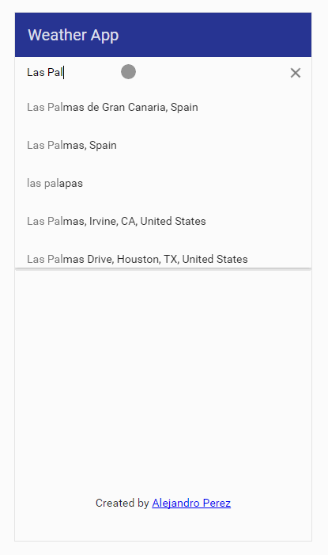

# AngularJS Weather App

AngularJS Weather App using Open Weather Maps and Google Places Autocomplete Predictions

# Screenshot

# Usage
Install dependencies: `bower install`, `npm install`

Run `node server.js` in terminal and navigate to localhost:3000

## Credits
Alejandro Perez Martin
